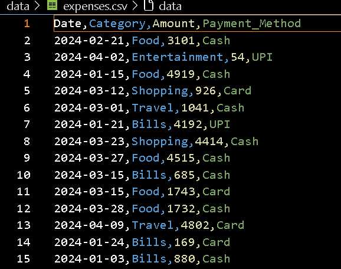
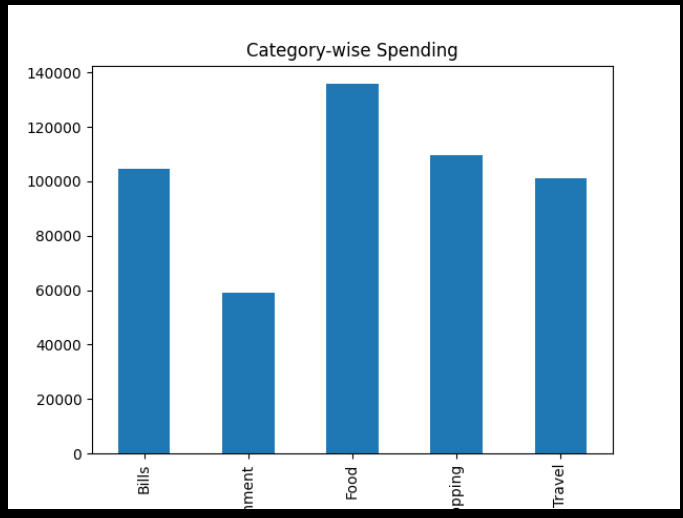
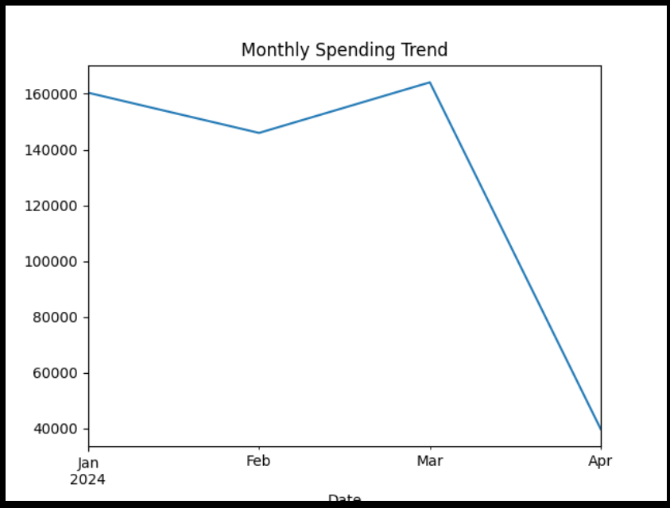
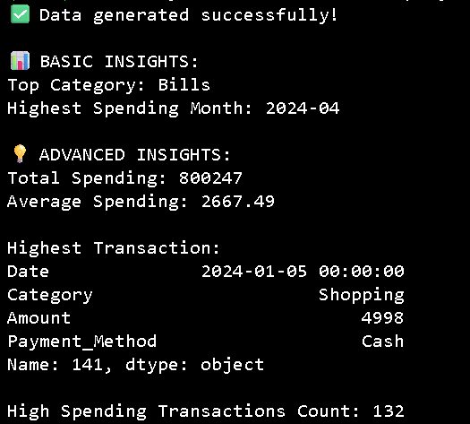

# 💰 Expense Tracker App (Data Science Project)


---

## 📌 Overview

The **Expense Tracker App** is a data-driven project designed to analyze and visualize personal financial data.
It simulates real-world expense tracking using synthetic data and provides meaningful insights into spending behavior.

---

## 🎯 Problem Statement

Managing personal finances manually is difficult and often leads to:

* Poor budgeting decisions
* Lack of spending awareness
* No visibility into financial patterns

---

## ✅ Solution

This project solves the problem by:

* Generating synthetic expense data
* Cleaning and processing data
* Performing Exploratory Data Analysis (EDA)
* Visualizing spending trends
* Providing actionable financial insights

---

## 🚀 Features

✔ Synthetic data generation
✔ Data cleaning & preprocessing
✔ Category-wise expense analysis
✔ Monthly spending trends
✔ High-spending transaction detection
✔ Insight generation for decision-making

---

## 🏗️ Project Architecture

```
User Input / Synthetic Data
        ↓
   Data Storage (CSV)
        ↓
   Data Cleaning (Pandas)
        ↓
   Data Analysis (EDA)
        ↓
   Visualization (Charts)
        ↓
   Insights & Decision Making
```

---

## ⚙️ Tech Stack

* 🐍 Python
* 📊 Pandas
* 🔢 NumPy
* 📈 Matplotlib
* 🎨 Seaborn

---

## 📂 Project Structure

```
Expense-Tracker-App/
│
├── data/
│   └── expenses.csv
│
├── notebooks/
│   └── analysis.ipynb
│
├── src/
│   ├── data_generator.py
│   ├── data_cleaning.py
│   ├── analysis.py
│   └── visualization.py
│
├── outputs/
│   ├── charts/
│   └── reports/
│
├── images/
│   ├── dataset.png
│   ├── category.png
│   ├── monthly.png
│   └── output.png
│
├── main.py
├── requirements.txt
└── README.md
```

---

## 🛠️ Installation & Setup

### 1️⃣ Clone Repository

```bash
git clone https://github.com/YOUR_USERNAME/expense-tracker-data-science.git
cd expense-tracker-data-science
```

### 2️⃣ Create Virtual Environment

```bash
python -m venv venv
```

### 3️⃣ Activate Environment

**Windows:**

```bash
venv\Scripts\activate
```

**Mac/Linux:**

```bash
source venv/bin/activate
```

### 4️⃣ Install Dependencies

```bash
pip install -r requirements.txt
```

---

## ▶️ How to Run

```bash
python main.py
```

---

## 📊 Results & Insights

### 🔍 Key Insights

* 📌 Highest Spending Category: **Bills**
* 📌 Peak Spending Month: **April 2024**
* 📌 Total Spending: ₹800,000+
* 📌 High-value transactions (>3000) detected

---

## 📸 Screenshots

### 📄 Dataset Preview



### 📊 Category-wise Spending



### 📈 Monthly Trend



### 💻 Output (Insights)



---

## 🧠 Business Impact

This project demonstrates how data can be used to:

* Track spending behavior
* Detect overspending patterns
* Improve budgeting strategies
* Support financial decision-making

---

## 🎯 Use Cases

* Personal finance tracking
* Budget planning
* Expense monitoring
* Financial analysis

---

## 🔮 Future Enhancements

🚀 Streamlit dashboard (interactive UI)
🚀 Real-time expense tracking
🚀 AI-based spending prediction
🚀 Budget alerts & notifications
🚀 Financial goal tracking

---

## 👨‍💻 Author

Vayunandan Mishra
🔗 LinkedIn: https://www.linkedin.com/in/vayunandan-mishra-9590302a2
💻 GitHub: https://github.com/Vayu-143

---

## ⭐ If you found this project useful

Give it a ⭐ on GitHub and share your feedback!

---
